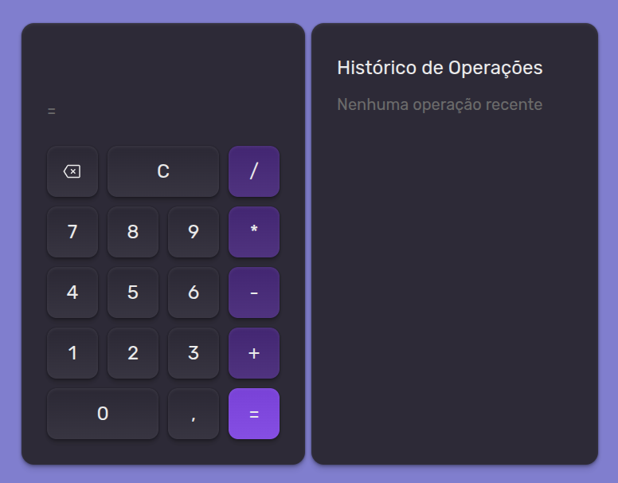

<h1 align="center">🧮 React Calculator</h1>

  Uma calculadora moderna desenvolvida com <strong>React + Vite</strong>, focada em aprendizado, organização de estado e boa experiência de usuário.

---

## 🚀 Sobre o Projeto

Este projeto é uma **calculadora funcional com histórico de operações**, desenvolvida como parte do meu processo de aprendizado em **React**.

> "O objetivo deste projeto foi consolidar conceitos fundamentais do React, como gerenciamento de estado, efeitos colaterais, compartilhamento de dados entre componentes e persistência de dados na local storage."

## 🚀 Deploy

🔗 Teste aqui a calculadora:  
https://react-calculator-topaz-iota.vercel.app/

## 🧠 O que eu aprendi

Durante o desenvolvimento deste projeto, pratiquei e aprendi:

- ⚛️ **useState** — controle de valores e estados da calculadora
- 🔄 **useEffect** — efeitos colaterais, atualização do histórico e limpeza
- 🌍 **useContext & createContext** — compartilhamento de estado global
- 🎨 **Phosphor Icons** — ícones modernos e leves
- ⚡ **React + Vite** — ambiente rápido e otimizado
- 🧩 Organização de componentes
- 🎨 Estilização com foco em UI/UX

✍️ _Maior desafio:_

> O maior desafio foi adaptar o projeto para o Vite, já que o professor estava usando Babel e a separação de componentes não era clara. Isso me ajudou a entender melhor o papel do useContext em estados globais.

---

## 🖥️ Funcionalidades

- ➕ Operações básicas (adição, subtração, multiplicação e divisão)
- 🕒 Histórico de operações
- 🧹 Limpar valores e resetar cálculos
- 🎨 Interface moderna e responsiva
- 🧠 Estado global para gerenciamento do histórico

---

## 📸 Layout

---

## 🛠️ Tecnologias Utilizadas

  
  
  
  

